# WINK Performance Review - Database Schema Pipeline

## 📊 Визуализация связей базы данных

```mermaid
erDiagram
    %% Основные сущности
    users ||--o{ review_cycles : "создает (admin/hr)"
    users ||--o{ tasks : "имеет задачи"
    users ||--o{ employee_goals : "ставит цели"
    users ||--o{ self_assessments : "проходит самооценку"
    users ||--o{ peer_reviews : "оценивает коллег"
    users ||--o{ manager_reviews : "оценивает как менеджер"
    users ||--o{ potential_assessments : "оценивает потенциал"
    users ||--o{ final_reviews : "получает итоговую оценку"
    
    %% Цикл оценки
    review_cycles ||--o{ employee_tasks : "содержит"
    review_cycles ||--o{ employee_goals : "содержит"
    review_cycles ||--o{ self_assessments : "содержит"
    review_cycles ||--o{ peer_reviews : "содержит"
    review_cycles ||--o{ manager_reviews : "содержит"
    review_cycles ||--o{ potential_assessments : "содержит"
    review_cycles ||--o{ final_reviews : "содержит"
    review_cycles ||--o{ calibration_sessions : "содержит"
    
    %% Этап 0: Распределение задач
    tasks ||--o{ task_leads : "имеет лидеров"
    tasks ||--o{ task_participants : "имеет участников"
    tasks ||--o{ task_annotations : "имеет аннотации"
    tasks ||--o{ employee_tasks : "назначается сотрудникам"
    
    task_leads }o--|| users : "лидер"
    task_participants }o--|| users : "участник"
    task_annotations }o--|| users : "автор"
    
    employee_tasks ||--o{ selected_respondents : "выбирает респондентов"
    employee_tasks }o--|| users : "employee"
    selected_respondents }o--|| users : "respondent"
    
    %% Функционал 1: Цели
    employee_goals ||--o{ goal_tasks : "содержит подзадачи"
    
    %% Функционал 2: Формы оценки
    form_templates ||--o{ form_sections : "содержит секции"
    form_sections ||--o{ form_static_blocks : "содержит блоки"
    
    form_templates ||--o{ self_assessment_questions : "определяет"
    form_templates ||--o{ peer_review_questions : "определяет"
    form_templates ||--o{ manager_review_questions : "определяет"
    
    self_assessment_questions ||--o{ self_assessments : "используется в"
    peer_review_questions ||--o{ peer_reviews : "используется в"
    manager_review_questions ||--o{ manager_reviews : "используется в"
    
    %% Функционал 2.4: Потенциал
    potential_assessments ||--o{ potential_detail_answers : "содержит ответы"
    potential_detail_questions ||--o{ potential_detail_answers : "задает вопрос"
    
    %% Функционал 3: Итоговые результаты
    users ||--o{ final_reviews : "employee"
    
    %% Функционал 4: Рекомендации
    recommendation_triggers ||--o{ employee_recommendations : "генерирует"
    employee_recommendations ||--o{ development_plans : "создает IDP"
    employee_recommendations }o--|| users : "для сотрудника"
    development_plans }o--|| users : "для сотрудника"
    
    %% Калибровка
    calibration_sessions ||--o{ calibration_participants : "участники"
    calibration_sessions ||--o{ calibration_adjustments : "корректировки"
    calibration_participants }o--|| users : "участник"
    calibration_adjustments }o--|| users : "employee"
    
    %% Аудит
    users ||--o{ audit_log : "действия"
    
    %% Определения таблиц
    users {
        int id PK
        string email UK
        string password_hash
        string first_name
        string last_name
        string role "employee|manager|hr|admin"
        int manager_id FK
        string department
        string position
        boolean is_active
    }
    
    review_cycles {
        int id PK
        string name
        date start_date
        date end_date
        string status
        int created_by FK
    }
    
    tasks {
        int id PK
        int cycle_id FK
        string title
        text description
        int order_number
    }
    
    employee_tasks {
        int id PK
        int employee_id FK
        int task_id FK
        int cycle_id FK
        string status
        int selected_count
    }
    
    employee_goals {
        int id PK
        int employee_id FK
        int cycle_id FK
        string title
        string expected_deadline
        text expected_results
        text key_tasks
    }
    
    goal_tasks {
        int id PK
        int goal_id FK
        string task_title
        date deadline
        string status
    }
    
    self_assessments {
        int id PK
        int employee_id FK
        int cycle_id FK
        int question_id FK
        int rating
        text answer_text
    }
    
    peer_reviews {
        int id PK
        int employee_id FK
        int reviewer_id FK
        int cycle_id FK
        int question_id FK
        int rating
        text answer_text
    }
    
    manager_reviews {
        int id PK
        int employee_id FK
        int manager_id FK
        int cycle_id FK
        int question_id FK
        int rating
        text feedback_summary
    }
    
    potential_assessments {
        int id PK
        int employee_id FK
        int manager_id FK
        int cycle_id FK
        array professional_qualities
        boolean takes_responsibility
        int growth_mindset_score
        string readiness_timeframe
        boolean is_successor
        int performance_score
        int potential_score
        string box_position "9-box позиция"
    }
    
    final_reviews {
        int id PK
        int employee_id FK
        int cycle_id FK
        decimal self_assessment_score
        decimal peer_review_avg_score
        decimal manager_review_score
        int potential_score
        int performance_score
        decimal total_score
        int rating
        string rating_category
        boolean salary_increase_recommended
    }
    
    employee_recommendations {
        int id PK
        int employee_id FK
        int cycle_id FK
        int trigger_id FK
        string recommendation_type
        text recommendation_text
        string priority
        string status
    }
    
    development_plans {
        int id PK
        int recommendation_id FK
        int employee_id FK
        text development_goals
        text action_items
        date target_date
        string status
    }
```



## 📋 Группы таблиц по функционалу

### 🔐 Управление пользователями
- **users** - Сотрудники и их роли

### 🔄 Цикл оценки
- **review_cycles** - Периоды оценки (квартал, год)

### 📝 Этап 0: Распределение задач и выбор респондентов
- **tasks** - Задачи для сотрудников (3 обязательные)
- **task_leads** - Лидеры задач
- **task_participants** - Участники задач
- **task_annotations** - Комментарии к задачам
- **employee_tasks** - Назначенные задачи сотрудникам
- **selected_respondents** - Выбранные респонденты для 360

### 🎯 Функционал 1: Постановка целей
- **employee_goals** - Цели сотрудников
- **goal_tasks** - Подзадачи к целям (3 на цель)

### 📋 Функционал 2: Формы и оценки

#### Шаблоны форм
- **form_templates** - Шаблоны форм оценки
- **form_sections** - Секции форм
- **form_static_blocks** - Статические блоки (инструкции)

#### 2.1 Самооценка
- **self_assessment_questions** - Вопросы самооценки
- **self_assessments** - Ответы самооценки

#### 2.2 Оценка коллег (360)
- **peer_review_questions** - Вопросы для оценки коллег
- **peer_reviews** - Оценки от коллег

#### 2.3 Оценка руководителя (360)
- **manager_review_questions** - Вопросы для руководителя
- **manager_reviews** - Оценки от руководителя

#### 2.4 Оценка потенциала
- **potential_assessments** - Оценка потенциала (9-box матрица)
- **potential_detail_questions** - Детальные вопросы
- **potential_detail_answers** - Детальные ответы

### 📊 Функционал 3: Итоговые результаты
- **final_reviews** - Итоговые оценки и рейтинги

### 💡 Функционал 4: Рекомендации и IDP
- **recommendation_triggers** - Триггеры для рекомендаций
- **employee_recommendations** - Рекомендации сотрудникам
- **development_plans** - Индивидуальные планы развития (IDP)

### 🔧 Калибровка и аудит
- **calibration_sessions** - Сессии калибровки
- **calibration_participants** - Участники калибровки
- **calibration_adjustments** - Корректировки оценок
- **audit_log** - Журнал действий

### 📈 Представления (Views)
- **v_employee_summary** - Сводка по сотрудникам
- **v_cycle_statistics** - Статистика по циклам

## 🔄 Pipeline данных

### Этап 0: Инициализация
```
HR создает цикл оценки → Распределяет задачи → Сотрудники получают 3 задачи → 
Выбирают респондентов для 360
```

### Функционал 1: Постановка целей
```
Сотрудник создает цель → Добавляет 3 подзадачи с дедлайнами → 
Руководитель согласовывает
```

### Функционал 2: Оценки
```
2.1: Сотрудник проходит самооценку (по вопросам из form_template)
↓
2.2: Коллеги (выбранные респонденты) оценивают сотрудника
↓
2.3: Руководитель оценивает сотрудника (360 + feedback)
↓
2.4: Руководитель оценивает потенциал → Определяется позиция в 9-box матрице
```

### Функционал 3: Расчет итогов
```
Собираются оценки:
- self_assessment_score (из self_assessments)
- peer_review_avg_score (среднее из peer_reviews)
- manager_review_score (из manager_reviews)
- potential_score (из potential_assessments)
- performance_score (из potential_assessments)
↓
Рассчитывается total_score и rating (0-10)
↓
Определяется rating_category:
  - outstanding (выдающийся)
  - good_result (хороший результат)
  - low_result (низкий результат)
  - no_result (нет результата)
↓
Сохраняется в final_reviews
```

### Функционал 4: Рекомендации
```
Система проверяет recommendation_triggers на основе:
- rating_category
- box_position (9-box)
- performance_score
- potential_score
↓
Генерирует employee_recommendations:
  - Обучение
  - Повышение
  - Ротация
  - План развития
↓
Создается development_plan (IDP) с action_items и target_date
```

### Калибровка
```
HR организует calibration_session → Добавляет calibration_participants →
Обсуждают оценки → Вносят calibration_adjustments →
Обновляются final_reviews
```

## 🔢 Счетчики

**Всего таблиц: 30**
- Управление: 1
- Циклы: 1
- Задачи (Этап 0): 6
- Цели: 2
- Формы: 3
- Оценки: 9
- Потенциал: 3
- Итоги: 1
- Рекомендации: 3
- Калибровка: 3
- Аудит: 1

**Представлений: 2**

## 🔗 Ключевые связи

1. **users** - центральная таблица, связана со всеми оценками
2. **review_cycles** - объединяет все данные одного периода оценки
3. **tasks** → **employee_tasks** → **selected_respondents** - цепочка выбора респондентов
4. **employee_goals** → **goal_tasks** - иерархия целей
5. **form_templates** → вопросы → оценки - шаблонизация форм
6. **potential_assessments** + все оценки → **final_reviews** - агрегация результатов
7. **recommendation_triggers** → **employee_recommendations** → **development_plans** - автоматизация рекомендаций

